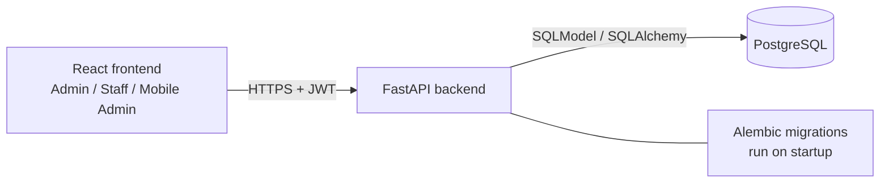

# POS Billing System

[](https://github.com/hiddensurf/pos-billing-system/actions/workflows/ci.yml)

A full-stack Point of Sale (POS) and Billing System designed for a textile/retail business. The system provides separate Admin and Staff billing portals, product and inventory management, supplier and purchase management, sales and returns, supplier payments, ledger and reports, and a mobile application-style Admin Portal.

## Live Application

**Web Application:**  
https://pos-billing-frontend.onrender.com/login

**Mobile Admin Portal:**  
https://pos-billing-frontend.onrender.com/m/login

**Backend API:**  
https://pos-billing-system-cbmo.onrender.com

**API Documentation:**  
https://pos-billing-system-cbmo.onrender.com/docs

## GitHub Repository

https://github.com/hiddensurf/pos-billing-system

## Features

### Admin Portal

- Dashboard
- Product CRUD
- Category management
- Supplier management
- Staff management
- Purchase management
- Supplier payments
- Product returns
- Supplier ledger
- Sales and transaction management
- Reports
- Inventory and stock tracking
- Low-stock monitoring

### Billing Portal

- Product search by name, SKU, or barcode
- Shopping cart
- Quantity controls
- Stock validation
- Discounts
- Cash, Card, and UPI payment methods
- Cash tendered and change calculation
- Sale creation
- Receipt generation
- 80mm receipt printing
- My Bills Today

### Mobile Admin Portal

A separate mobile application-style web interface is available for the complete Admin Portal.

Mobile routes include:

- Dashboard
- Products
- Categories
- Suppliers
- Staff
- Purchases
- Supplier Payments
- Returns
- Ledger
- Reports

## Technology Stack

### Frontend

- React
- Vite
- Tailwind CSS
- React Router
- Native Fetch API

### Backend

- Python
- FastAPI
- SQLModel
- SQLAlchemy
- Alembic
- JWT Authentication
- bcrypt

### Database

- PostgreSQL 17

### Deployment

- Render
- Docker
- Render PostgreSQL

## Authentication and Access Control

The application uses JWT-based authentication with role-based authorization.

### Admin

Administrators have access to the complete Admin Portal and administrative functionality.

### Staff

Staff users have access to the Billing Portal and staff-appropriate transaction functionality. Administrative routes are restricted from staff users.

## Test Credentials

### Admin

```text
Username: admin
Password: admin123
```

### Staff

```text
Username: staff1
Password: staff123
```

### Demo limitations

- The Render backend may take about 30-60 seconds to wake after inactivity.
- Cash, Card and UPI record a payment method; no bank or payment gateway is charged.
- Demo data is shared and can change during testing. These are public demo accounts, not production credentials.
- Mobile tables may scroll horizontally on narrow screens.

## Architecture



- Auth: OAuth2 password flow issues a JWT; `require_role("admin")` guards admin routes, billing routes allow admin and staff.
- A sale writes the sale, its items, a stock movement per item and a ledger entry in one transaction, and rejects insufficient stock.
- Schema changes go through Alembic (`backend/alembic`); the Docker image runs `alembic upgrade head` before starting the API.

## Run locally

```bash
docker compose up --build
# API on http://localhost:8000, docs on http://localhost:8000/docs
docker compose exec api python -m app.scripts.seed_users   # demo admin/staff users
```

Without Docker, copy `backend/.env.example` to `backend/.env`, point `DATABASE_URL` at a PostgreSQL database, then:

```bash
cd backend
pip install -r requirements.txt
alembic upgrade head
uvicorn app.main:app --reload
```

## Tests and CI

```bash
cd backend
pip install -r requirements-dev.txt
pytest -q
```

The suite has 19 tests covering login and token handling, role-based access, and sale creation (stock deduction, stock movements, ledger entries, discounts, cash-tendered and stock-limit errors). Line coverage of `backend/app` measured locally with `pytest --cov=app` is 60%; the remaining gaps are mostly the admin CRUD, purchase, supplier and report routers. GitHub Actions runs the tests against a PostgreSQL 17 service and builds the backend Docker image on every push and pull request.
